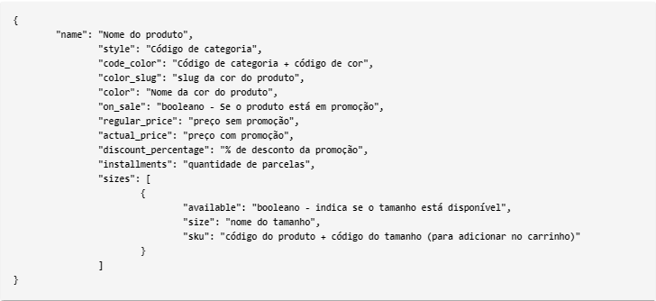

## Fashionista E-commerce

deploy: https://lucasbrilhante-fashionista-ecommerce.netlify.app/  
apresentação: https://www.youtube.com/watch?v=Ac4FO76aJlw

Fashionista é uma SPA(Single-Page Application) feito com ReactJS, que tem como objetivo a construção do front-end de um E-commerce de acessórios femininos responsivo. A aplicação consome um json de uma API, que contém o catálogo de produtos: https://undefined.netlify.app/api/catalog  
A aplicação é composta de um cabeçário, 2 modais e um corpo:  
O cabeçãrio serve para navegar para a página inicial, abrir a Busca e abrir a Sacola.  
O modal de Busca serve para filtrar os produtos em tempo real.  
O modal da Sacola serve para realizar ações, como aumentar/diminuir a quantidade ou remover um produto.  
O corpo tem 3 rotas:
* página inicial - mostra todos os produtos do catálogo, exibindo seus preços, sua imagem, seu preço promocional(se estiver em promoção) e a % de desconto.
* página do produto - mostra as informações do produto, quantidade de parcelamentos, tamanhos disponíveis e a ação de adicionar o item na sacola.
* página not-found - qualquer rota que for digitada errado no navegador, será direcionado para essa página.

Schema dos produtos:  

O projeto buscou utilizar recursos novos do React, como Hooks, Lazy e Suspense, LocalStorage, Intl e algumas outras ferramentas que são muito utilizadas no mercado. Não foi utilizado nenhum framework de UI para fazer os layouts, eles foram feitos do 0 utilizando html, css e styled-components.

Os componentes utilizados no projeto foram:
* Create React App
* React Router
* React Icons
* Redux
* Redux Thunk
* Redux Persist
* Axios
* Styled Components

## Estrutura do Projeto

* components - Componentes da aplicação.  
* hooks - Hooks personalisados.  
* pages - Conjunto de componentes que serão exibidos em uma determinada rota.  
* service - Consome o Json fornecido pela API.  
* store - Gerenciamento de estados globais utilizando Redux.  
* utils - Algumas funções que foram criadas para manipulação de strings.  

### obs: As variáveis do redux foram organizadas com o Duck Pattern(https://github.com/erikras/ducks-modular-redux) 
